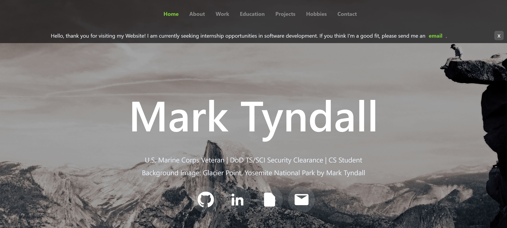

# Mark Tyndall – Personal Portfolio Website

Welcome to my personal portfolio website.  
This project showcases who I am, my work experience, education, technical skills, and projects in a clean, responsive UI. It also includes subtle animations (topbar/hero/socials), smooth scrolling with nav offset, and a project gallery modal.

🌐 **Live Demo:** [mtyndall88.github.io](https://mtyndall88.github.io)

---

## ✨ Features
- Topbar slide-in animation on load
- Hero text reveal after background is visible
- Smooth in-page navigation with correct topbar offset
- Scroll-down button and back-to-top button
- About section with circular photo carousel + skills grid
- Work Experience & Education timelines
- Projects with modal previews
- Full-bleed hobbies gallery
- Contact form via Formspree

---

## 🛠 Tech Stack
- **Languages:** HTML5, CSS3, JavaScript (Vanilla)
- **Tools/Services:** Formspree (contact form), GitHub Pages (hosting)

---

## 📸 Preview
<p align="center">
  
</p>

---

## 🚀 Getting Started

```bash
# Clone
git clone https://github.com/mtyndall88/mtyndall88.github.io.git
cd mtyndall88.github.io
# Serve locally (optional)
python -m http.server 5500
# open http://localhost:5500/
```
You can also just open index.html in a browser.

---

## 📬 Contact

- Email: [tyndall5818@gmail.com](mailto:tyndall5818@gmail.com)
- LinkedIn: [linkedin.com/in/mark-tyndall](https://www.linkedin.com/in/mark-tyndall/)
- GitHub: [github.com/mtyndall88](https://github.com/mtyndall88)

---

## 📄 License

Code is licensed under the [MIT License](LICENSE).  
Content (text, images, resume, etc.) is © 2025 Mark Tyndall. All rights reserved.